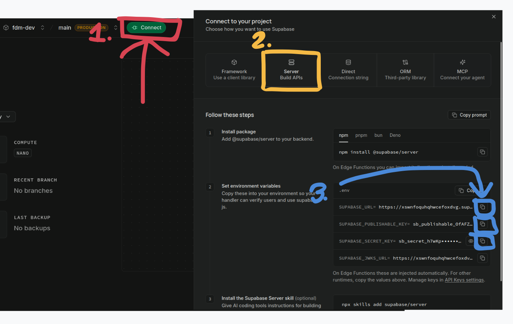

# First Davao Millennium System

## Project Setup

First, install dependencies:
```bash
npm install
```

Copy `.env.example` to `.env.local` and set the environment variables. Go to [our supabase project](https://supabase.com/dashboard/project/xswnfoquhqhwcefoxdvg) and navigate as shown in the image below




Then you can start the development server

```bash
npm run dev
```

The app will be available at [http://localhost:3000](http://localhost:3000).
